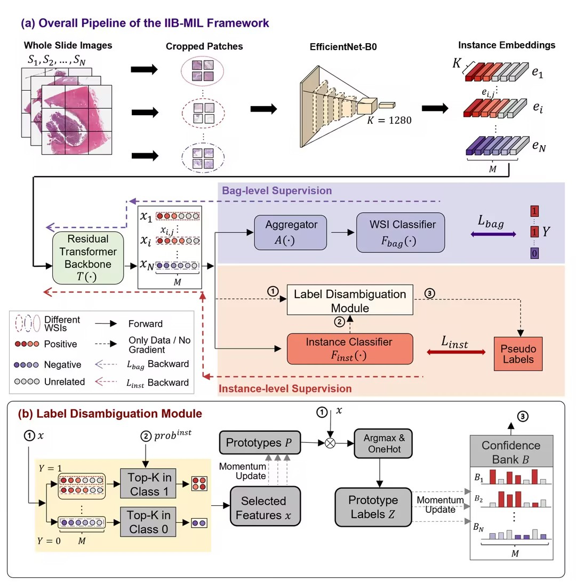

## IIB-MIL: Integrated instance-level and bag-level multiple instances learning with label disambiguation for pathological image analysis ##

Code for paper titled "IIB-MIL: Integrated instance-level and bag-level multiple instances learning with label disambiguation for pathological image analysis" submitted to MICCAI2023. The basic method and applications are introduced as follows:

IIB-MIL first transforms input huge-size WSI to a set of patch embeddings to simplify the following learning task using a pre-trained encoder, i.e. EfficientNet-B0. Then a specially-designed residual transformer backbone works to calibrate the obtained patch embeddings and encode the context information and correlation of patches. After that, IIB-MIL utilizes both a transformer-based bag-level and a label-disambiguation-based instance-level supervision to cooperatively optimize the model, where the bag-level loss is calculated referring to the WSI labels, while the instance loss is calculated referring to pseudo patch labels calibrated by the Label-Disambiguation module. Since bag-level supervision channel is trained to globally summarise information of all patches for prediction, the bag-level outputs are used as the final predictions during the test stage.

# Dependencies #
    albumentations==1.1.0
    efficientnet_pytorch==0.7.1
    lifelines==0.26.4
    numpy==1.21.6
    opencv_contrib_python==4.8.0.74
    opencv_python==4.4.0.46
    opencv_python_headless==4.5.4.60
    openslide_python==1.2.0
    pandas==1.3.5
    Pillow==8.4.0
    pretrainedmodels==0.7.4
    rich==10.16.1
    scikit_image==0.19.1
    scikit_learn==1.0.1
    Shapely==1.7.1
    torch==1.7.1
    torchvision==0.8.2
    tqdm==4.62.3
    yacs==0.1.8

# Dataset
The preprocessed test data of TCGA-NSCLC and TCGA-RCC Dataset is available on Zenodo at: https://zenodo.org/record/8169144.

# Pathological Image Analysis  #
This code uses the centralized configs. Before using this code, a config file needs to be edited to assign necessary parameters. The config files are provided for different Datasets:

    configs/LUAD-GM.yaml
    configs/TCGA-NSCLC.yaml
    configs/TCGA-RCC.yaml

1、First, in order to split the WSI into patches, execute the following script.

    python ./data_prepare/WSI_cropping.py  \
      --dataset path_to_data_folder  \
      --output path_to_output_folder  \
      --scale 20 --patch_size 1120 --num_threads 16

2、Then, extract features from each patch. a pre-trained feature extractor can be utilized here (e.g. EfficientNet-B0 trained on the ImageNet).

    python ./data_prepare/extract_feature.py --cfg cconfigs/LUAD-GM.yaml

    # or

    python ./data_prepare/extract_feature.py --cfg cconfigs/TCGA-NSCLC.yaml

    # or

    python ./data_prepare/extract_feature.py --cfg cconfigs/TCGA-RCC.yaml

3、Next, combine features of one WSI.

    python ./data_prepare/merge_patch_feat.py --cfg configs/LUAD-GM.yaml

    # or

    python ./data_prepare/merge_patch_feat.py --cfg configs/TCGA-NSCLC.yaml

    # or

    python ./data_prepare/merge_patch_feat.py --cfg configs/TCGA-RCC.yaml

4、Finally, we can use the model with preprocessed data

    python ./main/test.py --cfg configs/LUAD-GM.yaml --input_data_file data/LUAD-GM.txt

    # or

    python ./main/test.py --cfg configs/TCGA-NSCLC.yaml --input_data_file data/TCGA-NSCLC.txt

    # or

    python ./main/test.py --cfg configs/TCGA-RCC.yaml --input_data_file data/TCGA-RCC.txt

## Acknowledgement
This repo partially uses code from [Deformable DETR](https://github.com/fundamentalvision/Deformable-DETR.git), [T2T-ViT](https://github.com/yitu-opensource/T2T-ViT.git) and [iRPE] (https://github.com/microsoft/Cream.git).